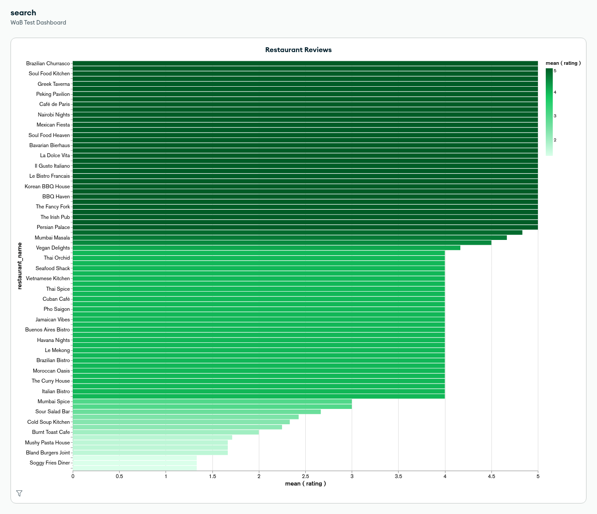

# Retrieval Augmented Generation with Atlas Vector Search

The motivation for this project was to create a proof-of-concept to better understand how a simple RAG leverages vector search and Large Language Models to provide Generative AI use case.

### Here's What I did
- Ask ChatGPT to generate fake restaurant reviews with corresponding ratings
- Vectorized the reviews using *mxbai-embed-large* embedding model
- Feed the reviews back into MongoDB
- Set up an Atlas Vector Search index
- Use MongoDB as my Vector Database
- Write and vectorize prompt/query
- Retrieve information from MongoDB
- Pass results from MongoDB as context into the language generation model *llama2*

### Here's my city of fake resturants

